* Table of Contents
{:toc}

--------------------------------------------------------------------------------------------------------------------

## **Setting up, getting started**

Refer to the guide [_Setting up and getting started_](SettingUp.md).

--------------------------------------------------------------------------------------------------------------------

## **Introduction**

### **Purpose**
This document describes the architecture and system design of the Teletubbies desktop application
for Telemarketers and Telemarketer Supervisors.

### **Scope**
The document aims to comprehensively cover the software architecture and software design decisions for
the implementation of Teletubbies. It is intended to serve as a guide for the developers, the designers, and the testers
for the application.

The definitions for the emboldened terms can be found in the [_Glossary_](#glossary) Section.

### **Design Goals**
The developers work closely with telemarketers and telemarketer supervisors to better understand their needs, so that
the requirements of the product can be as clear-cut as possible.

#### _User-Centricity_
Teletubbies can be used by both telemarketers and supervisors, and chooses the appropriate features according to the
current user's **role**, so that the user can work effectively and efficiently to complete their tasks.

#### _Improved Workflow Efficiency_
Teletubbies is optimised for **Command-Line Interface** (CLI) usage, which streamlines workflow
within the application by centralising the entering of commands in a single text input window.

#### _Seamless Data Integration_
Teletubbies allows telemarketers, and their supervisors to share and merge data seamlessly. Synchronization of customer
data between telemarketers and their supervisors is often a necessary aspect of their job, and Teletubbies provides
avenues to make this process easy and hassle-free.

#### _Data Safety and Recoverability_
With many contacts stored in a contact list, it is vital that the user’s current progress is saved 
frequently to assist in data recovery in the event of unexpected system failure. Hence, the contact list is saved 
after each command issued by the user.

Additionally, in the event of human error, an undo command is available for users to revert to previous states
within the session itself.

#### _Scalability & Maintainability_
Within a team of developers, it is important that the developers reduce dependencies within the project to increase
testability and extensibility.

In addition, with requirements that constantly change, it is important to be able to easily modify features and
functionalities that have already been written without disturbing other related components. Therefore, the main 
components of the application such as the `Logic`, `UI`, `Model`, and `Storage` are separated into decoupled modules.

Along with the strict adherence to software design principles, such as **Single Responsibility** and
**Separation of Concerns**, the modularity of the software design allows future developers to add features to Teletubbies
without having to deal with tedious side-effects.

### **Glossary**
**_Command-line Interface (CLI)_**: A user interface that allows users to interact with a system through text commands.

**_Graphical User Interface (GUI)_**: A user interface that allows users to interact with a system through graphical icons.

**_User stories_**: Simple descriptions of features told from the perspective of the user.

**_Completion Status_**: A contact can be marked as either “completed” or “not completed”, indicating if the contact
has been contacted.

**_Role_**: Users are assigned either the role of telemarketer or supervisor.

**_Single Responsibility Principle_**:  A software engineering principle that states that every module, class or
function in a computer program should be responsible for and encapsulate only a single part of
the program’s functionality.

**_Separation of Concerns Principle_**: A software engineering principle that states that programs should be separated
into distinct sections which address concerns, or sets of information that affects the code of a computer program.

--------------------------------------------------------------------------------------------------------------------

## **Acknowledgements**

* [_SE-EDU Remark Command tutorial_](https://nus-cs2103-ay2122s1.github.io/tp/tutorials/AddRemark.html)

--------------------------------------------------------------------------------------------------------------------

## **System Overview**

<div markdown="span" class="alert alert-primary">

:bulb: **Tip:** The `.puml` files used to create diagrams in this document can be found in the [diagrams](https://github.com/se-edu/addressbook-level3/tree/master/docs/diagrams/) folder. Refer to the [_PlantUML Tutorial_ at se-edu/guides](https://se-education.org/guides/tutorials/plantUml.html) to learn how to create and edit diagrams.
</div>

### Architecture


The ***Architecture Diagram*** given above explains the high-level design of the App.

Given below is a quick overview of main components and how they interact with each other.

#### Main components of the architecture

`Main` has two classes called [`Main`](https://github.com/AY2122S1-CS2103T-W15-4/tp/blob/master/src/main/java/teletubbies/Main.java) and [`MainApp`](https://github.com/AY2122S1-CS2103T-W15-4/tp/blob/master/src/main/java/teletubbies/MainApp.java). The `Main` component,
* (At app launch) initializes the components in the correct sequence, and connects them up with each other.
* (At shut down) shuts down the components and invokes cleanup methods where necessary.

[**`Commons`**](#common-classes) represents a collection of classes used by multiple other components.

The rest of the App consists of four components.

* [**`UI`**](#ui-component): The UI of the App.
* [**`Logic`**](#logic-component): The command executor.
* [**`Model`**](#model-component): Holds the data of the App in memory.
* [**`Storage`**](#storage-component): Reads data from, and writes data to, the hard disk.

#### How the architecture components interact with each other

The Sequence Diagram below outlines how the components interact with each other, in a scenario where the user issues the command `delete -p 87654321`.


Each of the four main components (also shown in the diagram above),

* defines its *API* in an `interface` with the same name as the Component.
* implements its functionality using a concrete `{Component Name}Manager` class (which follows the corresponding API `interface` mentioned in the previous point.

For example, the `Logic` component defines its API in the `Logic.java` interface and implements its functionality using the `LogicManager.java` class which follows the `Logic` interface. Other components interact with a given component through its interface rather than the concrete class (reason: to prevent outside component's being coupled to the implementation of a component), as illustrated in the (partial) class diagram below.


The sections below give more details of each component.

### UI component

**API** : [`Ui.java`](https://github.com/AY2122S1-CS2103T-W15-4/tp/blob/master/src/main/java/teletubbies/ui/Ui.java)

Here's a (partial) class diagram of the `UI` component:


The UI consists of a `MainWindow` that is made up of parts such as `CommandBox`, `ResultDisplay`, `PersonListPanel`, `StatusBarFooter`, etc. All these parts, including the `MainWindow` itself, inherit from the abstract `UiPart` class which captures the commonalities between the classes that represent parts of the visible GUI.

The `UI` component uses the JavaFX UI framework. The layout of these UI parts are defined in matching `.fxml` files that are in the `src/main/resources/view` folder. For example, the layout of the [`MainWindow`](https://github.com/AY2122S1-CS2103T-W15-4/tp/blob/master/src/main/java/teletubbies/ui/MainWindow.java) is specified in [`MainWindow.fxml`](https://github.com/AY2122S1-CS2103T-W15-4/tp/blob/master/src/main/resources/view/MainWindow.fxml).

The `UI` component,

* executes user commands using the `Logic` component.
* listens for changes to `Model` data so that the UI can be updated with the modified data.
* keeps a reference to the `Logic` component, because the `UI` relies on the `Logic` to execute commands.
* depends on some classes in the `Model` component, as it displays each `Person` object residing in the `Model`.

### Logic component

**API** : [`Logic.java`](https://github.com/AY2122S1-CS2103T-W15-4/tp/blob/master/src/main/java/teletubbies/logic/Logic.java)

Here's a (partial) class diagram of the `Logic` component:


How the `Logic` component works:
1. When `Logic` is called upon to execute a command, it uses the `InputParser` class to parse the user command.
2. This results in a `Command` object (more precisely, an object of one of its subclasses, e.g. `AddCommand`) which is executed by the `LogicManager`.
3. The command can communicate with the `Model` when it is executed (e.g. to add a person).
4. The result of the command execution is encapsulated as a `CommandResult` object which is returned back from `Logic`.

#### Commands with UI Effects

Commands that need the UI to require a UI response from the user (e.g. opening a file chooser) will need to set up a UI consumer (`ThrowingConsumer<MainWindow>`), a functional
interface that allows the commands to access the functionality of `MainWindow`. The following is an example of a constructor for `CommandResult` that includes this
set-up:

```java
return new CommandResult(SHOWING_HELP_MESSAGE, CommandResult.UiEffect.SHOW_HELP, 
        MainWindow::handleHelp);
```

If the `UiEffect` type (the second constructor argument) does not exist for any new command that gets added, this
corresponding `UiEffect` type should be added into the `UiEffect` enum in `CommandResult`.

On the other hand, if a command has no special UI response, the `UiEffect` type should be `NONE`.

The previous implementation of `UiEffect` was solely restricted to help and exit commands. Creating more commands with UI effects would have required hard-coding
more flags for these effects in `CommandResult`, and in turn hard-coding these effects again in `MainWindow`. This would have required significant modifications in both of
these classes, especially if new commands are added in.

The implementation of the consumer interface instead allows these UI effects to be open for extension and closed for modification.
Now, specific UI effects can be specified within the respective command, without having to change the code in `MainWindow` that handles the command's UI effect.

The Sequence Diagram below illustrates the interactions within the `Logic` component for the `execute("delete -i 1")` API call.


<div markdown="span" class="alert alert-info">:information_source: **Note:** The lifeline for `DeleteCommandParser` should end at the destroy marker (X) but due to a limitation of PlantUML, the lifeline reaches the end of diagram.
</div>

Here are the other classes in `Logic` (omitted from the class diagram above) that are used for parsing a user command:


How the parsing works:
1. When called upon to parse a user command, the `InputParser` class creates an `XYZCommandParser`. Here, `XYZ` is a placeholder for the specific command name, e.g. `AddCommandParser`.
2. The newly created `XYZCommandParser` class utilizes the other classes shown above, such as `ParserUtil`, `CliSyntax`, etc. to parse the user command and create a `XYZCommand` object, e.g. `AddCommand`.
3. The `InputParser` will then return the newly created `XYZCommand` object as a `Command` object.

All `XYZCommandParser` classes like `AddCommandParser` and `DeleteCommandParser` inherit from the `Parser` interface so that they can be treated similarly where possible, such as during testing.
Similarly, all `XYZCommand` classes inherit from the `Command` class.

### Model component

**API** : [`Model.java`](https://github.com/AY2122S1-CS2103T-W15-4/tp/blob/master/src/main/java/teletubbies/model/Model.java)

Here's a (partial) class diagram of the `Model` component:


The `Model` component,

* stores the list of contacts and all previous lists (or address books) in`VersionedAddressBook`, which inherits from `AddressBook`.
* stores a history of all commands that were input by the user using `CommandInputHistory`.
* stores the currently 'selected' `Person` objects (e.g. results of a search query) as a separate _filtered_ list, exposed to outsiders as an unmodifiable `ObservableList<Person>`.
* stores a `UserPref` object that represents the user’s preferences.
* does not depend on any of the other three components (as the `Model` represents data entities of the domain, they should make sense on their own without depending on other components).


### Storage component

**API** : [`Storage.java`](https://github.com/AY2122S1-CS2103T-W15-4/tp/blob/master/src/main/java/teletubbies/storage/Storage.java)


The `Storage` component,
* can save both address book data and user preference data in json format, and read them back into corresponding objects.
* inherits from both `AddressBookStorage` and `UserPrefStorage`, which means it can be treated as either one (if only the functionality of only one is needed).
* depends on some classes in the `Model` component (because the `Storage` component's job is to save/retrieve objects that belong to the `Model`)

### Common classes

Classes used by multiple components are in the `teletubbies.commons` package.

--------------------------------------------------------------------------------------------------------------------

## **Implementation**

This section describes some noteworthy details on how certain features are implemented.

### Import / Export Features

#### Implementation

The `import` and `export` mechanism is supported by all the main components, specifically in the following ways:

* The `Ui` component is accessed in `CommandResult` through a UI consumer (`ThrowingConsumer<MainWindow>`). This allows the user to interact with the JavaFx FileChooser to select files to be imported/exported to.

* The execution of the `ImportCommand` and `ExportCommand` is distinct from other commands executed by `Logic` because it is passed to the UI consumer in the `CommandResult` due to their reliance on the UI file chooser.

* For import, the `Model` component is accessed to set the new AddressBook of contacts. On the other hand, export filters the AddressBook of the `Model` using the tags specified in the user command to retrieve contacts to be exported.

* Functions in `Storage` were used to write AddressBooks to JSON files as well as read and convert JSON files to AddressBook objects.

The following sequence diagram shows how the `import` operation works:

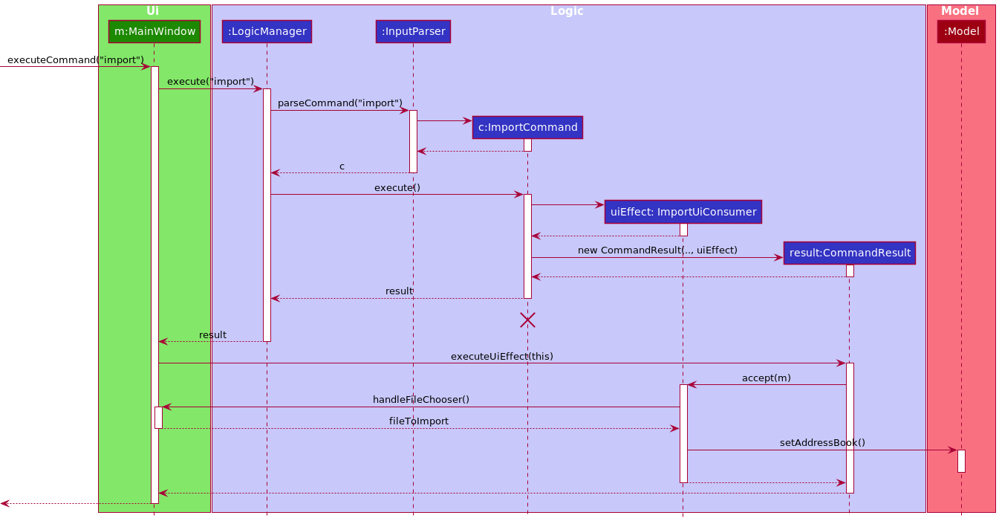

<div markdown="span" class="alert alert-info">:information_source: **Note:** The lifeline for `ImportCommand` should end at the destroy marker (X) but due to a limitation of PlantUML, the lifeline reaches the end of diagram.
</div>

#### Design Considerations

**Aspect: User Interface**

* **Alternative 1 (current choice):** Import/Export command can be executed by CLI command or menu bar button.
    * Pros: Users are given the flexibility of choosing either method to enter the command according to their preference.
    * Cons: Contacts to be exported are unable to be filtered by tags in the menu bar button.

* **Alternative 2:** Import and export are buttons in the menu bar only.
    * Pros: Similar to the layout of menu bars in Microsoft Office Applications, which might be familiar to users.
    * Cons: Target users can type fast and might prefer typing in commands. Contacts to be exported are unable to be filtered by tags.

### Profile Feature

#### Implementation

Setting the user's profile is facilitated through the `ProfileCommand` and the `ProfileCommandParser` class, which
parses the user's input to create a new `UserProfile` object to be set in the current `Model` component.

The following activity diagram summarizes what happens when a user executes a `profile` command:

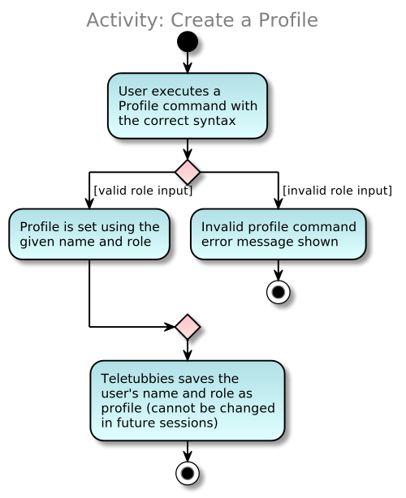

The following sequence diagram further illustrates how the `profile` command operation works:


<div markdown="span" class="alert alert-info">:information_source: **Note:** The lifeline for `ProfileCommandParser` and `ProfileCommand` should end at the destroy marker (X) but due to a limitation of PlantUML, the lifeline reaches the end of diagram.
</div>

#### Design Considerations

**Aspect: Parameters of the `profile` command**

* **Alternative 1 (current choice):** Profile is set with both name and role as mandatory fields.
    * Pros: Ensures that both name and role are accounted for when changing the profile.
    * Cons: Both fields must be entered for the user to set the profile, which can be tedious if it has to be done multiple times.

* **Alternative 2:** Profile can be set with only the name, or both name and role.
    * Pros: Allows users to change their name alone without having to enter role as well.
    * Cons: The cost of implementation is not heavily outweighed by the explicit need for the feature, as there should be infrequent changes in the user's name.
    
**Aspect: Number of times the user's profile can be set**

* **Alternative 1 (current choice):** Profile can only be set once per user, excluding any undo.
    * Pros: Ensures that users are unable to switch between telemarketer and supervisor functionalities. In the case where
the user has misspelt their name, they can still use the undo command to revert back and re-enter the name for their profile.
    * Cons: The user is unable to set their profile again in the case where their name or role has changed.

* **Alternative 2:** No limits are placed on the number of times the user is able to set their profile.
    * Pros: Allows users to change their name or role as needed, hassle-free.
    * Cons: There is no explicit need for the feature, as there should be infrequent changes in the user's name and role.

### Profile feature - Reset profile

#### Implementation

As stated above, users are only able to set their profile **once** using the `profile` command. 
However, there may be times when there is a need for the users to change their name and/or role. In such circumstances,
it is possible for the users to reset their profile by manually deleting `preferences.json`.

The following activity diagram summarizes what happens when a user deletes `preferences.json`:

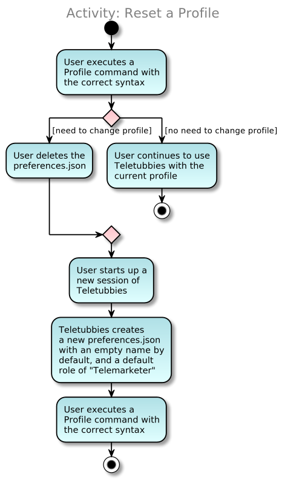

### Mark Contacts as Done Feature

#### Implementation

Marking contacts as done, or contacted, is assisted by `CompletionStatus`. It has a composition association with `Person`
and holds a boolean value indicating that the person has been contacted by the telemarketer.

The following sequence diagram shows how the `done` operation works:

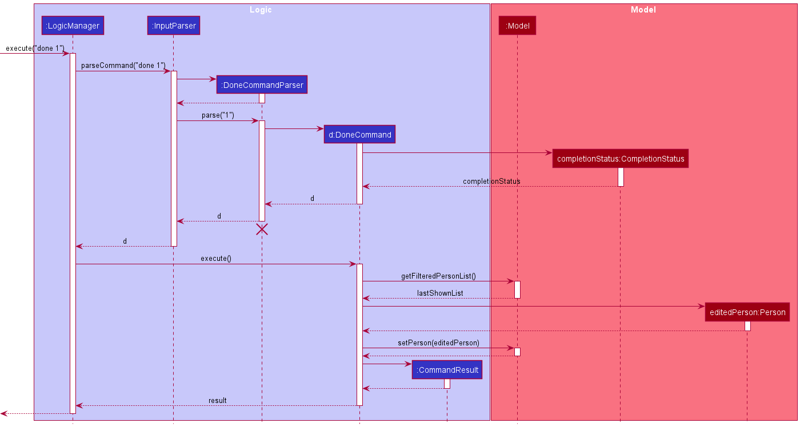

### Delete Contacts Feature

#### Implementation

Deletion of a contact is supported by the `DeleteCommand` and `DeleteCommandParser` classes. The `DeleteCommandParser`
parses the user's input and deletes the contact at the given index or with the given phone number.

The following sequence diagram shows how the `delete` operation works:

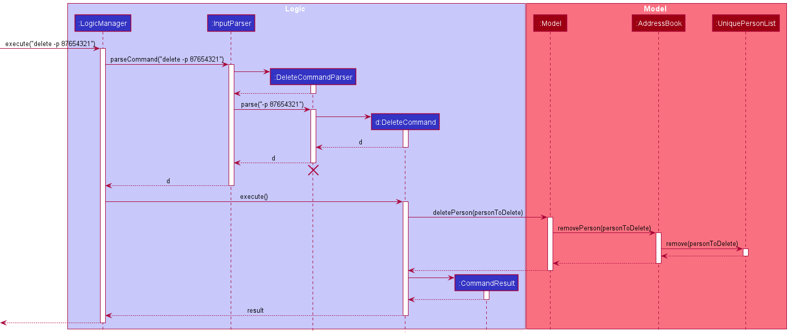

<div markdown="span" class="alert alert-info">:information_source: **Note:** The lifeline for `DeleteCommandParser` should end at the destroy marker (X) but due to a limitation of PlantUML, the lifeline reaches the end of diagram.
</div>

The following activity diagram summarizes what happens when a user executes a delete command:

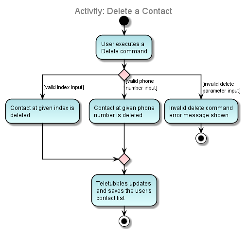

#### Design Considerations

**Aspect: Parameters of the `delete` command**

Since the telemarketer is responsible for talking to customers on the phone to sell products,
it will be useful for them to interact with their contact lists through the customer's phone number.

* **Alternative 1 (current choice):** Delete using either index or phone number.
    * Pros: Flexibility in method of deletion, as users can specify whether they would like to reference a contact by
      index or phone number by using the `-i` or `-p` prefixes.
    * Cons: Slightly more complicated for user to delete a contact, as a longer command has to be typed.

* **Alternative 2:** Delete via phone number only.
    * Pros: Implementation is more straightforward, as there is only one type of input to be expected.
    * Cons: Removes the convenience of deleting using a contact's index.

### History tracking features

We saw a need for Teletubbies to track the history of the application as a core feature while we were devising our user stories. This would allow users to traverse back
and regain access to previous states, as well as access previous commands.

The features that required the tracking of history were the
* `undo`/`redo` commands,
* `history` command, and
* Unix-style way of obtaining previous and next commands, using the **UP** and **DOWN**
arrow keys

The `HistoryManager` class was created to serve as an abstraction for devices that can store the history of any object. It's sole responsibility is to
manage the history of the type of object we wanted to track, including the current state and a list of previous states or previously undone states. It is a generic class, which
allows for efficient code re-usability.

`HistoryManager` uses a stack-like data structure, with a *Last-In, First-out* (LIFO) method of storing states.

`HistoryManager` contains an `ArrayList` called `historyStack` which serves as the stack-like data structure to store the states of the object in question, and a `stackPointer` which stores the
index of the current state in question.

When `HistoryManager` is first initialised, `historyStack` is empty while `stackPointer` does not point to any state, since there are none stored.


Then, new states of the object with type parameter `T` are added and stored in the `HistoryManager`, using `HistoryManager#commitAndPush(T item)`. This method causes the new item to be added to
`historyStack` and the `stackPointer` to be pointed to the new item.


<div markdown="span" class="alert alert-info">:information_source: **Note:** `HistoryManager#commitAndPush(T item)` returns a *new* `HistoryManager` object which has the new state pushed to the top of the
`historyStack`. This ensures the immutability of historyStack and guarantees that if anything is added, `stackPointer` will point to the latest version.
</div>

The `HistoryManager#undo()` and `HistoryManager#redo()` methods allow the pointer to be pushed up or down to previous states or previously undone states, by simply pointing to the object below the current state or above it.

For instance, this is how `HistoryManager` looks like after `HistoryManager#undo()` is called twice:

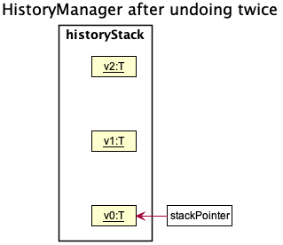

And after `HistoryManager#redo()` is called once, it looks like this:


<div markdown="span" class="alert alert-info">:information_source: **Note:** `HistoryManager#undo()` and `HistoryManager#redo()` *do not* return new `HistoryManager` objects as the `historyStack` is not manipulated.
</div>

Calling `HistoryManager#commitAndPush(T item)` here causes the states above the `stackPointer` to be removed and replaced by the new state, as indicated by item.
Once again, a new `HistoryManager` is created, this time with the new state added and the state `v2` to be removed.


`HistoryManager` also has a `HistoryManager#peek()` method which returns the current state that is pointed at by the `stackPointer`, as well as the
`HistoryManager#resetFullHistory()` method which simply resets the `stackPointer` to point to the top of the `historyStack`.

#### Design Considerations

**Aspect: How can the previous states be stored**

* **Alternative 1 (current choice):** Use a single stack to record the history
  * Pros: Easy to visualise
  * Cons: Need to be careful while committing as both previous states and previously undone states exist on the same stack. Does not adhere closely to Single Responsibility Principle.

* **Alternative 2 (proposed):** Use a 2-stack method to record history, one which stores the states which can be undone and the other to store the states which can be redone.
  * The `HistoryManager` would originally have 2 stacks: an undo stack and a redo stack. Before actions are undone, the redo stack would be empty while the new states would be added
directly to the top of redo stack. 
    
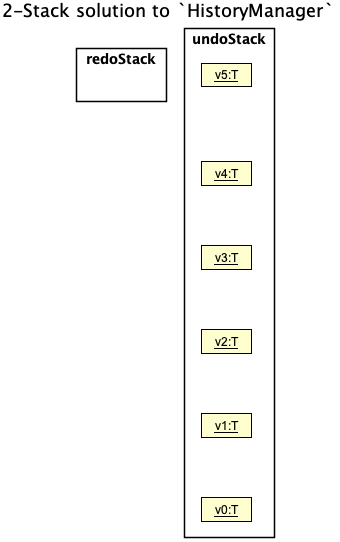

  * Then, as `HistoryManager#undo()` or `HistoryManager#redo()` is called states would be popped from one stack and pushed to the other. 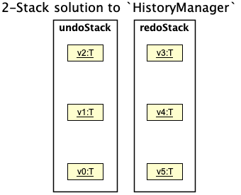
  * If we want to commit to `HistoryManager`, all we have to do is clear `redoStack` and push the new state to `undoStack`. 
  * Pros: Single responsibility principle, `undoStack` only manages states to be undone while `redoStack` only manages states to be redone.
  * Cons: Difficult to visualise.


### Undo/Redo feature

The `undo` command allows the telemarketer or the supervisor to revert to previous states. This mechanism is supported by the `VersionedAddressBook`. `VersionedAddressBook` extends
`AddressBook`, but internally implements the `HistoryManager` class to store and track `ReadOnlyAddressBook`, the states of the address book.

It also implements the following methods:

* `VersionedAddressBook#commitCurrentStateAndSave()` - This action adds a copy of the current state to `HistoryManager`
* `VersionedAddressBook#commitWithoutSavingCurrentState()` - This action clears previously undone states stored by `HistoryManager`. This method will only be called
* `VersionedAddressBook#undo()` - This action restores a previously stored state as stored in `HistoryManager`
* `VersionedAddressBook#redo()` - This action restores a previously undone state as stored in `HistoryManager`

The `Model` interface also exposes methods such as `Model#undoAddressBook()`, `Model#redoAddressBook()` and `Model#commitAddressBook()` that allows the states to be changed.

An example of the usage scenario of `undo` is given below:

Step 1. Teletubbies is launched for the first time by the user. `VersionedAddressBook` is first initialised with an initial address book state.


Step 2. The user changes the current state of Teletubbies by executing a `done 1` command. The `done` command calls `Model#commitAddressBook()` which in turn causes
`VersionedAddressBook#commitCurrentStateAndSave()` to be called. This causes the newest state of Teletubbies (which is different from it's previous state) to be
saved.


Step 3. The user changes the current state of Teletubbies by executing a `delete -i 1` command. The `delete` command calls `Model#commitAddressBook()` as before, causing
the state of Teletubbies to be changed.


Step 4. The user decides to undo by executing `undo`. This causes `Model#undoAddressBook()` to be called, which causes `HistoryManager` to revert back to state `tb1`.


<div markdown="span" class="alert alert-info">:information_source: **Note:** If the current state is the earliest
possible state, in this case tb0, Teletubbies will no longer be revertible, and the undo command will throw an exception. The undo command uses
`Model#canUndoAddressBook()` to confirm if this is the case.
</div>

The sequence diagram below illustrates the undo operation:


However, the `redo` command simply does the opposite and calls `Model#redoAddressBook()`, which causes the undone state to be reinstated.

<div markdown="span" class="alert alert-info">:information_source: **Note:** If the current state is the latest
possible state, in this case tb2, Teletubbies will no longer be able to restore undone states, and the redo command will throw an exception. The undo command uses
`Model#canRedoAddressBook()` to confirm if this is the case.
</div>

Step 5. The user decides to execute the command `find Alex`. However, `find` does not modify `VersionedAddressBook`. Commands that do not modify `VersionedAddressBook` do not call
`Model#commitAddressBook()` which allows the history of states to remain unchanged.


Step 6. The `clear` command is then executed by the user. `Model#commitAddressBook()` is called by the command, which causes the states after the current state to no longer be stored.


#### Design Considerations

**Aspect: How `undo` and `redo` would be executed**

* **Alternative 1 (current choice):** Just save the entire AddressBook state.
  * Pros: Easier to implement, debug and trace together
  * Cons: Very memory-intensive as multiple states and copies are stored.

* **Alternative 2:** Only store the difference in the AddressBook states, much like GitHub's approach to version control. This means a separate data structure which stores the difference between states like a tree is needed.
  * Pros: Much less memory-intensive since only differences between each version are saved
  * Cons: Difficult to implement a tree-like data structure that can effectively track the changes within the given time period. Undo would simply be a traversal up the tree while redo would be traversing down. Cannot reuse `HistoryManager`

### History feature

The `history` command allows the user to view the previous commands that were given to Teletubbies. This mechanism is supported by `CommandInputHistory`, which internally implements `HistoryManager`
to store and track user inputs which are `String`s.

`CommandInputHistory` also implements the following methods:

* `CommandInputHistory#getChronologicallyAscendingHistory()` - This method returns a List of Strings which are the commands keyed in by the user
in chronological order, i.e. the first element is the earliest command given by the user.
* `CommandInputHistory#getChronologicallyDescendingHistory()` - This method returns a List of Strings which are the commands keyed in by the user
in chronologically descending order, i.e. the first element is the latest command given by the user.
* `CommandInputHistory#addCommandInput(String input)` - This method calls `HistoryManager#resetFullHistory()` before calling `HistoryManager#commitAndPush()` to add a new String
to the `HistoryManager`. This is necessary as `CommandInputHistory` should keep track of all inputs without overwriting them.

The `Model` interface also exposes methods such as `Model#addCommandInput()`, `Model#getNextCommand()` and `Model#getPreviousCommand()` that allows access to the previous and next commands
as stored by the `HistoryManager` in `CommandInputHistory`.

The sequence diagram below shows the mechanism in storing the input given by the user.

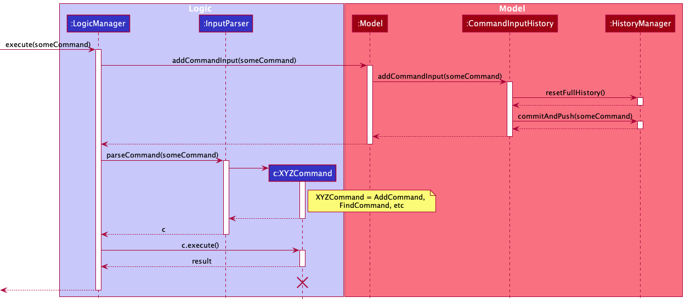

This allows the command to be stored regardless of the outcome of the command, even if it is an invalid command.

The sequence diagram below shows the execution path which is taken by the `history` command.

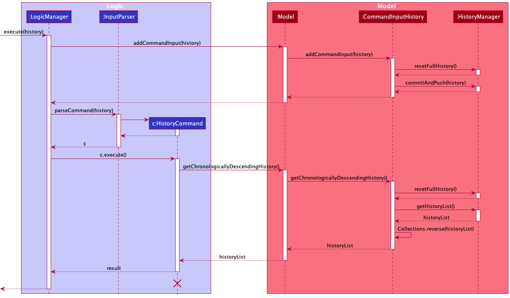

### Use of **UP** and **DOWN** to get previous or next commands

As we were inspired heavily by the elegance of Unix-like systems and their ability to cycle through previously input commands,
we decided to implement this as well. This feature is facilitated by the `Model` and `CommandHistoryInput`.

The UI component uses EventHandlers that detects if the **UP** or **DOWN** buttons are pressed by the user. Then, UI calls upon `Model#getPreviousCommand()`
or `Model#getNextCommand()` to get the previous or next command as stored by `CommandInputHistory`.

The activity diagram below show how the **UP** button key press is handled.


The activity diagram below show how the **DOWN** button key press is handled.

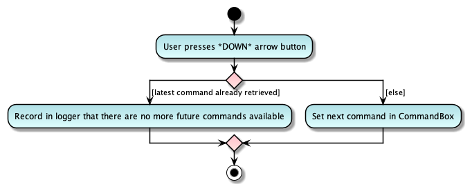

#### Design Considerations

**Aspect: The interaction between `UI` and `CommandInputHistory`**

* **Alternative 1 (current choice):** Let `Model` house `CommandInputHistory`
    * Pros: Minimal dependency between `Logic` and the components of `Model`
    * Cons: Additional dependency between `UI` and `Model` created as `UI` needs to call `Model` methods

* **Alternative 2:** Let `Logic` house `CommandInputHistory`
    * Pros: Since `Logic` already interacts with `UI`, no additional coupling created between them.
    * Cons: Requires passing of `CommandInputHistory` to `InputParser` in order to handle `history` commands. The parser should not
  have to know about `CommandInputHistory`

### Auto completion feature

Since Teletubbies is designed to be mainly used through its CLI, we prioritised the convenience of our users in typing
out commands by implementing an auto completion feature.

The autocompletion mechanism is facilitated by the `CommandMap` class. The `CommandMap` contains a a `HashMap`
called `classMap` which stores the individual command words as keys and the `XYZCommand` classes as values. Within
each `XYZCommand` class, the recommended command fields for the command are stored in a `List` called `RECOMMENDED_FLAGS`.
This list is not stored if the command does not require command fields. Here, `XYZ` is a placeholder for the specific
command name, e.g. `AddCommand`.

The UI component uses EventHandlers that detects if the **TAB** button is pressed by the user. Then, UI calls
upon `CommandMap#getClass()` to retrieve the class that corresponds to the input command, which then prints out
the command fields specified within the `RECOMMENDED_FLAGS` list (or does not print out anything, in the case that no command fields
are required for the input command).

--------------------------------------------------------------------------------------------------------------------

## **Documentation, Logging, Testing, Configuration, Dev-ops**

* [Documentation guide](Documentation.md)
* [Testing guide](Testing.md)
* [Logging guide](Logging.md)
* [Configuration guide](Configuration.md)
* [DevOps guide](DevOps.md)

--------------------------------------------------------------------------------------------------------------------

## **Appendix: Requirements**

### Product scope

#### **Target User Profiles**


David Wong
* works as a **telemarketer** from home and makes internet calls on his computer
* likes to import/export data quickly
* wants to mark the contacts that he has already called and/or successfully marketed to
* wants to keep track of his progress
* has a need to manage a significant number of contacts
* prefer desktop apps over other types
* can type fast
* prefers typing to mouse interactions
* is reasonably comfortable using CLI apps

<br>

Anne Goh
* works as a **telemarketing supervisor** from home
* needs to pass lists of contacts to her subordinates to contact
* wants to monitor the performance of her subordinates
* has a need to manage a significant number of contacts
* prefer desktop apps over other types
* can type fast
* prefers typing to mouse interactions
* is reasonably comfortable using CLI apps

<br>

#### **Value Proposition**

* Able to import / export data into an easy-to-view format, useful for those who are not experienced at working with data files such as JSON / CSV / etc.
* Easy to add/annotate details on users to keep track of user defined metrics
* Ability to get analytics about metrics for progress-tracking


### User stories

Priorities:
* High (must have) - `* * *`
* Medium (nice to have) - `* *`
* Low (unlikely to have) - `*`

| Priority | As a …​                              | I want to …​                  | So that I can…​                                                           |
| -------- | --------------------------------------- | -------------------------------- | ---------------------------------------------------------------------------- |
| `* * *`  | Telemarketer                            | import the list of customers     | easily view all the contacts I need to call                                  |
| `* * *`  | Telemarketer                            | export the list of customers     | send the list to my supervisor                                               |
| `* * *`  | Telemarketing Supervisor                | import the list of customers     | easily view the contacts completion status of my subordinates                |
| `* * *`  | Telemarketing Supervisor                | export the list of customers     | send the list to my subordinates for them to complete                        |
| `* * *`  | Telemarketer / Telemarketing Supervisor | save data from current session   | save my current progress to continue during the next session                 |
| `* * *`  | Telemarketer / Telemarketing Supervisor | load data from previous session  | pick up where I left off from my previous session                            |
| `* * *`  | Telemarketer                            | indicate my name under 'profile' | identify myself in progress reports for my supervisor                        |
| `* * *`  | Telemarketer / Telemarketing Supervisor | indicate my role under 'profile' | get access to the functionalities that cater to my specific job              |
| `* * *`  | Telemarketer                            | mark a contact as completed      | see that I have already called a contact successfully                        |
| `* * *`  | Telemarketing Supervisor                | add a contact                    | add contacts that need to be called by my subordinates                       |
| `* * *`  | Telemarketing Supervisor                | delete a contact                 | remove contacts that no longer need to be tracked or have been added wrongly |

*{ More to be added as new features are introduced }*

### Use cases

For all use cases below, the **System** is the `Teletubbies` application, and the **Actor** is the user, unless specified otherwise.

#### Use case: Delete a person

**MSS**

1.  User requests to list persons
2.  Teletubbies shows a list of persons
3.  User requests to delete a specific person in the list
4.  Teletubbies deletes the person

    Use case ends.

**Extensions**

* 2a. The list is empty.

  Use case ends.

* 3a. The given index is invalid.

    * 3a1. Teletubbies shows an error message.

  Use case resumes at step 2.

#### Use case: Telemarketer workflow during a shift
* Actor: Telemarketer User
* Precondition: Telemarketer has obtained a list of customers assigned by Supervisor

**MSS**

1. User starts up the Teletubbies desktop application.
2. User selects and imports the JSON file containing the list of contacts for the shift from a file location.
3. Teletubbies displays the imported contacts.
4. User copies a customer’s contact number and makes the phone call
5. User marks the customer as completed
6. Teletubbies saves the file and displays that the call for the contact is completed.

Use case ends.

**Extensions**

* 3a. Teletubbies does not detect a JSON file in the specified file path.

  * 3a1. Teletubbies displays a message prompting the Telemarketer to try importing JSON file again.
  * 3a2. Telemarketer imports a JSON file containing the customers’ details
  * Steps 3a1 to 3a2 are repeated until a valid JSON file is selected

  Use case resumes from step 4.


* 3b. Teletubbies detects that the JSON file selected is not in the correct format.

    * 3b1. Teletubbies displays a message informing the Telemarketer that the file is not in the correct format.
    * 3b2. Telemarketer informs their Supervisor about the error

  Use case ends.


* 5a. Teletubbies detects that index used in the command is invalid.
  * 5a1. Teletubbies displays a message to inform Telemarketer about the input error
  * 5a2. Telemarketer re-enters the command with a correct index number for the contact
  * Steps 5a1 to 5a2 are repeated until a valid customer phone number is input

  Use case resumes from step 6.


### Non-Functional Requirements
1. New telemarketers should be able to easily use the application. (**Quality requirement**)
2. The application should save and load data fast, and startup should take a few seconds at the most. (**Performance requirement / Response time**)
3. Data should be saved frequently and automatically to allow for easy recovery on possible crashes. (**Disaster recovery**)
4. The product should work on all OS, and both 32-bit and 64-bit environments. (**Technical / Environment requirement**)
5. The application should be able to efficiently (without a noticeable slowdown) handle standard operations (add, delete, search, etc) for up to 10,000 users. (**Data requirement**, ie. volatility)
6. The product project is expected to adhere to a schedule that delivers a feature set every two weeks. (**Process requirements**)
7. The product is not required to handle in-app sharing of data across users on different devices. (**Project scope**)
8. The product should be available for potential testers to test the capabilities of the product / find any bugs or issues. (**Testability**)

--------------------------------------------------------------------------------------------------------------------

## **Appendix: Instructions for manual testing**

Given below are instructions to test the app manually.

<div markdown="span" class="alert alert-info">:information_source: **Note:** These instructions only provide a starting point for testers to work on;
testers are expected to do more *exploratory* testing.

</div>

### Launch and shutdown

1. Initial launch

   1. Download the [jar file](https://github.com/AY2122S1-CS2103T-W15-4/tp/releases) and copy into an empty folder

   1. Double-click the jar file Expected: Shows the GUI with a set of sample contacts. The window size may not be optimum.

1. Saving window preferences

   1. Resize the window to an optimum size. Move the window to a different location. Close the window.

   1. Re-launch the app by double-clicking the jar file.<br>
       Expected: The most recent window size and location is retained.

1. _{ more test cases …​ }_

### Deleting a person

1. Deleting a person while all persons are being shown

   1. Prerequisites: List all persons using the `list` command. Multiple persons in the list.

   1. Test case: `delete -i 1`<br>
      Expected: First contact is deleted from the list. Details of the deleted contact shown in the status message. 

   1. Test case: `delete -i 0`<br>
      Expected: No person is deleted. Error details shown in the status message. Status bar remains the same.

   1. Other incorrect delete commands to try: `delete`, `delete -i x`, `...` (where `x` is larger than the list size)<br>
      Expected: Similar to previous.

1. _{ more test cases …​ }_

### Saving data

1. Dealing with missing/corrupted data files

   1. _{explain how to simulate a missing/corrupted file, and the expected behavior}_

1. _{ more test cases …​ }_

--------------------------------------------------------------------------------------------------------------------
